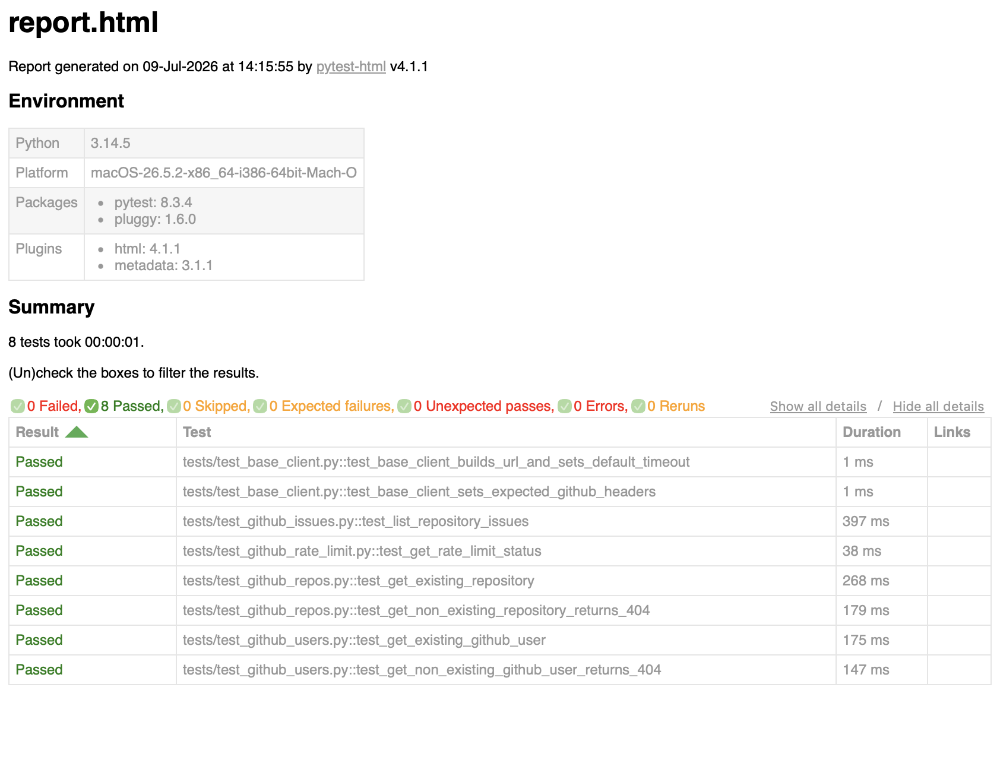

# Python API Testing

A demo Python API automation framework for testing GitHub REST API endpoints.



## Stack

- Python 3.10+
- pytest
- requests
- pytest-html
- python-dotenv
- jsonschema
- PyGithub
- ruff

## What this framework covers

- Reusable API client
- Environment-based configuration
- Optional GitHub token support
- Positive and negative API tests
- JSON schema validation
- Pytest markers
- HTML reports
- GitHub Actions CI workflow

## Demo endpoints used

The framework uses safe public `GET` endpoints:

- `GET /users/{username}`
- `GET /repos/{owner}/{repo}`
- `GET /repos/{owner}/{repo}/issues`
- `GET /rate_limit`

## Project structure

```text
github_api_testing_framework/
├── api/
│   ├── base_client.py
│   └── github_client.py
├── config/
│   └── settings.py
├── tests/
│   ├── conftest.py
│   ├── test_github_users.py
│   ├── test_github_repos.py
│   ├── test_github_issues.py
│   └── test_github_rate_limit.py
├── utils/
│   ├── assertions.py
│   └── schemas.py
├── pytest.ini
└── requirements.txt
```

## Setup

```bash
python3 -m venv .venv
```

Activate it:

```bash
source .venv/bin/activate
```

Install dependencies:

```bash
python -m pip install -r requirements.txt
```

Create your local `.env` file:

```bash
cp .env.example .env
```

## Run tests

You can use `python -m pytest` directly or the included `Makefile` shortcuts.

Run all tests:

```bash
python -m pytest
```

Run tests that do not call the real GitHub API:

```bash
python -m pytest -m "not live"
```

This is the default CI path and should stay stable without network access to GitHub.

Run tests that call the real GitHub API:

```bash
python -m pytest -m live
```

Run smoke tests only:

```bash
python -m pytest -m smoke
```

Run tests and generate HTML report:

```bash
python -m pytest --html=reports/report.html --self-contained-html
```

Equivalent shortcuts:

```bash
make test
make test-unit
make test-live
make report
make smoke
```

## Configuration

Edit `.env`:

```env
BASE_URL=https://api.github.com
GITHUB_API_VERSION=2026-03-10
GITHUB_TOKEN=
DEMO_USERNAME=octocat
DEMO_OWNER=octocat
DEMO_REPO=Hello-World
REQUEST_TIMEOUT=15
RETRY_TOTAL=2
RETRY_BACKOFF_FACTOR=0.3
API_DEBUG=false
```

Set `API_DEBUG=true` to log request and response details while debugging.

## Notes

This demo uses read-only public endpoints, so it is safe to run without creating, editing, or deleting GitHub data.
